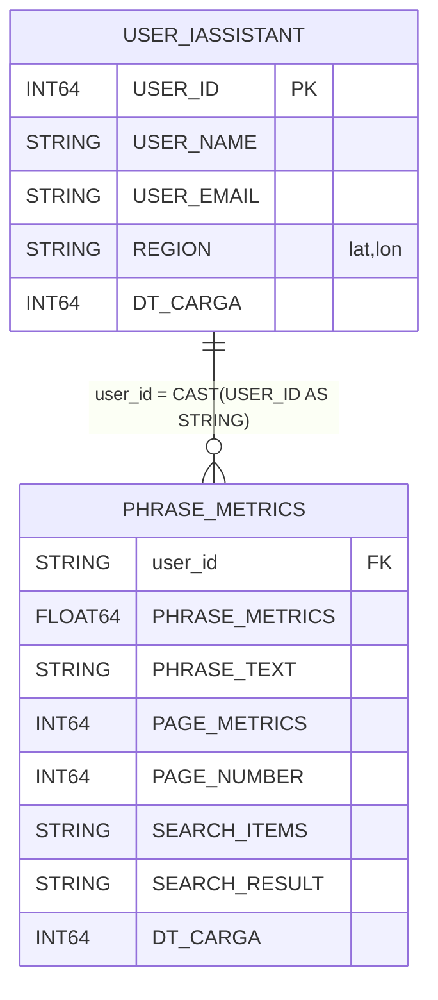

# BigQuery IAM + Authorized Views

Eu montei este projeto para gerenciar acesso no BigQuery a partir de uma tabela de usuarios e expor dados sensiveis apenas via views mascaradas. Aqui deixo o passo a passo que realmente funcionou no meu ambiente `case-de-engenharia-de-dados`, apenas o que foi executado com sucesso.

---

GIT : https://github.com/dinx0/iassistant

## Como eu trago os dados (extracao/ingestao)

**Fontes e formatos**

* Fonte 1 (proximo do real): metrica de busca do meu IA Assistant via API do Google Cloud + extensao do Chrome. Esses eventos chegam ja normalizados pela API.
* Fonte 2 (ficticia para o projeto): base de usuarios em JSON (newline-delimited). 99% dos registros sao sinteticos.

**Pipelines e modo de chegada**

* **Streaming (quase tempo real)** para a tabela `phrase_metrics`:

  * a extensao envia eventos para minha API e eu faco **streaming inserts** direto no BigQuery (sem ETL intermediario). O dado ja vem tratado pela propria API, entao aplico so cast/normalizacao leve na view.
  * modelo aqui e "padrao kappa (event-driven)": eventos entram continuamente e eu consulto sempre a versao mais recente no BQ.
* **Lote (batch)** para a tabela `user_iassistant`:

  * eu **carrego JSON** para o BigQuery usando load jobs (`bq load`), quando preciso renovar a base. E um fluxo de dimensao/carga inicial.
  * sem orquestrador dedicado: uso scripts shell + `bq`/`jq`. As mascaras e regras de acesso ficam nas **views** e no **IAM do dataset**.

**Por que assim**

* Quero focar no controle de acesso e mascaramento no proprio BigQuery (menos componentes).
* Streaming direto evita ETL quando o produtor ja valida o schema.
* Batch em JSON resolve bem para carga inicial e dados ficticios do case.

---

## Arquitetura final (o que esta rodando)

* **Projeto**: `case-de-engenharia-de-dados`
* **Dataset base**: `845415315315` (mesma regiao usada em `sec_v`)
* **Dataset de views**: `sec_v` (criado/recriado na mesma regiao do dataset base)
* **Tabelas base**:

  * `user_iassistant` — PK logica: `USER_ID (INT64)`
  * `phrase_metrics` — sem PK fisica; relaciona por `user_id (STRING)`
* **Views mascaradas (em producao)**:

  * `sec_v.user_iassistant_v` — mascara email e lat/lon extraida de `REGION`
  * `sec_v.phrase_metrics_v` — mascara `PHRASE_TEXT` e `SEARCH_RESULT`
* **Relacao**: `USER_IASSISTANT.USER_ID (INT64)` <-> `PHRASE_METRICS.user_id (STRING)` via `CAST`.

---

## IAM via tabela (o que eu rodei)

Regra simples: `USER_ID 1..5 => READER`, `USER_ID >= 6 => WRITER` no dataset base `845415315315`. Eu gero as entradas `access[]` com `bq` + `jq` e aplico sem duplicar.

```bash
# variaveis
export PROJECT_ID="case-de-engenharia-de-dados"
export DATASET_ID="845415315315"
export DATASET_REF="$PROJECT_ID:$DATASET_ID"
export SRC_TABLE="$PROJECT_ID.$DATASET_ID.user_iassistant"

# loop a partir da tabela (evita duplicacoes)
bq query --nouse_legacy_sql --format=csv "
WITH base AS (
  SELECT DISTINCT CAST(USER_ID AS INT64) AS user_id,
         LOWER(TRIM(USER_EMAIL)) AS email
  FROM \`$SRC_TABLE\`
  WHERE USER_EMAIL IS NOT NULL
)
SELECT email,
       CASE WHEN user_id BETWEEN 1 AND 5 THEN 'READER' ELSE 'WRITER' END AS role
FROM base
" | tail -n +2 | while IFS=, read -r email role; do
  [[ -z "$email" || -z "$role" ]] && continue
  bq show --format=prettyjson "$DATASET_REF" > ds.tmp.json
  jq --arg em "$email" --arg r "$role" \
     '.access += [{"role":$r,"userByEmail":$em}] | .access |= (map(tojson)|unique|map(fromjson))' \
     ds.tmp.json > ds.apply.json
  bq update --source=ds.apply.json "$DATASET_REF"
  rm -f ds.tmp.json ds.apply.json
done
```

Nota: emails ficticios/inexistentes o BigQuery recusa (nao entram na policy).

---

## Views mascaradas (SQL que eu apliquei)

### `sec_v.user_iassistant_v`

* `email_mascarado`: primeira letra + \*\*\* + dominio
* `lat_mascarada` / `lon_mascarada`: extraidas de `REGION` com regex e `ROUND(..., 2)`

```sql
CREATE OR REPLACE VIEW `case-de-engenharia-de-dados.sec_v.user_iassistant_v` AS
SELECT
  CAST(USER_ID AS INT64) AS user_id,
  CONCAT(
    SUBSTR(LOWER(TRIM(USER_EMAIL)),1,1),
    '***',
    REGEXP_EXTRACT(LOWER(TRIM(USER_EMAIL)), r'(@.*)$')
  ) AS email_mascarado,
  ROUND(
    IF(ARRAY_LENGTH(REGEXP_EXTRACT_ALL(REGION, r'(-?[0-9]+(?:\.[0-9]+)?)'))>0,
       CAST(REGEXP_EXTRACT_ALL(REGION, r'(-?[0-9]+(?:\.[0-9]+)?)')[OFFSET(0)] AS FLOAT64), NULL),
    2
  ) AS lat_mascarada,
  ROUND(
    IF(ARRAY_LENGTH(REGEXP_EXTRACT_ALL(REGION, r'(-?[0-9]+(?:\.[0-9]+)?)'))>1,
       CAST(REGEXP_EXTRACT_ALL(REGION, r'(-?[0-9]+(?:\.[0-9]+)?)')[OFFSET(1)] AS FLOAT64), NULL),
    2
  ) AS lon_mascarada
FROM `case-de-engenharia-de-dados.845415315315.user_iassistant`;
```

### `sec_v.phrase_metrics_v`

* `phrase_text_masked = SUBSTR(PHRASE_TEXT, 1, 20) || '...'`
* `search_result_masked = SUBSTR(SEARCH_RESULT, 1, 60) || '...'`

```sql
CREATE OR REPLACE VIEW `case-de-engenharia-de-dados.sec_v.phrase_metrics_v` AS
SELECT
  CAST(user_id AS STRING) AS user_id,
  CAST(PHRASE_METRICS AS FLOAT64) AS phrase_metrics,
  IFNULL(SUBSTR(PHRASE_TEXT, 1, 20) || '...', NULL) AS phrase_text_masked,
  CAST(PAGE_METRICS AS INT64) AS page_metrics,
  CAST(PAGE_NUMBER AS INT64) AS page_number,
  SEARCH_ITEMS AS search_items,
  IFNULL(SUBSTR(SEARCH_RESULT, 1, 60) || '...', NULL) AS search_result_masked,
  CAST(DT_CARGA AS INT64) AS dt_carga
FROM `case-de-engenharia-de-dados.845415315315.phrase_metrics`;
```

### Authorized View no dataset base (eu adicionei assim)

```bash
BASE="case-de-engenharia-de-dados:845415315315"
LOC=$(bq show --format=prettyjson "$BASE" | jq -r .location)

# garante dataset de views na mesma regiao
bq mk --dataset --location="$LOC" case-de-engenharia-de-dados:sec_v 2>/dev/null || true

bq show --format=prettyjson "$BASE" > base.json
jq '.access += [
  {"view":{"projectId":"case-de-engenharia-de-dados","datasetId":"sec_v","tableId":"user_iassistant_v"}},
  {"view":{"projectId":"case-de-engenharia-de-dados","datasetId":"sec_v","tableId":"phrase_metrics_v"}}
] | .access |= (map(tojson)|unique|map(fromjson))' base.json > base_patched.json
bq update --source=base_patched.json "$BASE"
```

---

## Relacao e consultas

Chave logica: `USER_IASSISTANT.USER_ID (INT64)` <-> `PHRASE_METRICS.user_id (STRING)` via `CAST`.

```sql
SELECT
  u.USER_ID,
  v.email_mascarado,
  p.phrase_metrics,
  p.phrase_text_masked,
  p.search_result_masked,
  p.page_metrics,
  p.page_number,
  p.dt_carga
FROM `case-de-engenharia-de-dados.sec_v.user_iassistant_v` AS v
JOIN `case-de-engenharia-de-dados.845415315315.user_iassistant` AS u
  ON v.user_id = u.USER_ID
JOIN `case-de-engenharia-de-dados.sec_v.phrase_metrics_v` AS p
  ON CAST(p.user_id AS INT64) = u.USER_ID
LIMIT 100;
```

---

## Como reproduzir rapido (copy/paste)

> pre requisitos: `gcloud` autenticado no projeto, `bq` e `jq` instalados; habilitar **Data Access logs** para BigQuery no Console (IAM e Admin > Audit Logs), e criar o dataset base `845415315315` previamente.

```bash
# 0) variaveis
export PROJECT_ID=case-de-engenharia-de-dados
export BASE=case-de-engenharia-de-dados:845415315315
export VIEWS=case-de-engenharia-de-dados:sec_v

# 1) detectar regiao do dataset base e recriar o dataset de views na mesma regiao
LOC=$(bq show --format=prettyjson "$BASE" | jq -r .location)
bq rm -f -d "$VIEWS" 2>/dev/null || true
bq mk --dataset --location="$LOC" "$VIEWS"

# 2) criar/atualizar as views mascaradas
bq query --use_legacy_sql=false --location="$LOC" <<'SQL'
CREATE OR REPLACE VIEW `case-de-engenharia-de-dados.sec_v.user_iassistant_v` AS
SELECT
  CAST(USER_ID AS INT64) AS user_id,
  CONCAT(SUBSTR(LOWER(TRIM(USER_EMAIL)),1,1),'***',REGEXP_EXTRACT(LOWER(TRIM(USER_EMAIL)), r'(@.*)$')) AS email_mascarado,
  ROUND(IF(ARRAY_LENGTH(REGEXP_EXTRACT_ALL(REGION, r'(-?[0-9]+(?:\.[0-9]+)?)'))>0,
           CAST(REGEXP_EXTRACT_ALL(REGION, r'(-?[0-9]+(?:\.[0-9]+)?)')[OFFSET(0)] AS FLOAT64), NULL),2) AS lat_mascarada,
  ROUND(IF(ARRAY_LENGTH(REGEXP_EXTRACT_ALL(REGION, r'(-?[0-9]+(?:\.[0-9]+)?)'))>1,
           CAST(REGEXP_EXTRACT_ALL(REGION, r'(-?[0-9]+(?:\.[0-9]+)?)')[OFFSET(1)] AS FLOAT64), NULL),2) AS lon_mascarada
FROM `case-de-engenharia-de-dados.845415315315.user_iassistant`;
SQL

bq query --use_legacy_sql=false --location="$LOC" <<'SQL'
CREATE OR REPLACE VIEW `case-de-engenharia-de-dados.sec_v.phrase_metrics_v` AS
SELECT
  CAST(user_id AS STRING) AS user_id,
  CAST(PHRASE_METRICS AS FLOAT64) AS phrase_metrics,
  IFNULL(SUBSTR(PHRASE_TEXT, 1, 20) || '...', NULL) AS phrase_text_masked,
  CAST(PAGE_METRICS AS INT64) AS page_metrics,
  CAST(PAGE_NUMBER AS INT64) AS page_number,
  SEARCH_ITEMS AS search_items,
  IFNULL(SUBSTR(SEARCH_RESULT, 1, 60) || '...', NULL) AS search_result_masked,
  CAST(DT_CARGA AS INT64) AS dt_carga
FROM `case-de-engenharia-de-dados.845415315315.phrase_metrics`;
SQL

# 3) autorizar as views no dataset base
bq show --format=prettyjson "$BASE" > base.json
jq '.access += [
  {"view":{"projectId":"case-de-engenharia-de-dados","datasetId":"sec_v","tableId":"user_iassistant_v"}},
  {"view":{"projectId":"case-de-engenharia-de-dados","datasetId":"sec_v","tableId":"phrase_metrics_v"}}
] | .access |= (map(tojson)|unique|map(fromjson))' base.json > base_patched.json
bq update --source=base_patched.json "$BASE"

# 4) criar SA de leitura e testar impersonation
SA=bq-viewer-demo
EMAIL="$SA@$PROJECT_ID.iam.gserviceaccount.com"
gcloud iam service-accounts create "$SA" 2>/dev/null || true
# papel de job no projeto (criar consultas)
gcloud projects add-iam-policy-binding "$PROJECT_ID" \
  --member="serviceAccount:$EMAIL" --role="roles/bigquery.jobUser" >/dev/null
# acesso somente no dataset de views
bq update --dataset_access add:serviceAccount:$EMAIL:READER "$VIEWS"
# garantir que NAO tem acesso na base
bq update --dataset_access remove:serviceAccount:$EMAIL "$BASE" 2>/dev/null || true
# testar como SA
MEU=$(gcloud config get-value account)
gcloud iam service-accounts add-iam-policy-binding "$EMAIL" \
  --member="user:$MEU" --role="roles/iam.serviceAccountTokenCreator" >/dev/null

gcloud config set auth/impersonate_service_account "$EMAIL" >/dev/null
# deve falhar na base
bq query --nouse_legacy_sql 'SELECT COUNT(1) FROM `case-de-engenharia-de-dados.845415315315.user_iassistant`' || true
# deve funcionar na view
bq query --nouse_legacy_sql 'SELECT * FROM `case-de-engenharia-de-dados.sec_v.user_iassistant_v` LIMIT 5'
# desfazer impersonation
gcloud config unset auth/impersonate_service_account >/dev/null
```

> se o seu projeto estiver em outro local, ajuste `PROJECT_ID`, datasets e os nomes das views.

---

## Validacao (como eu testei)

* Criei a SA `bq-viewer-demo@case-de-engenharia-de-dados.iam.gserviceaccount.com` com:

  * `READER` **so** em `sec_v`
  * `roles/bigquery.jobUser` no **projeto** (para criar jobs)
* Removi qualquer acesso dessa SA no dataset base
* Resultado: na base deu **Access Denied** (como esperado) e nas views funcionou com os dados mascarados

---

## Observabilidade e logs (o que eu configurei e validei)

Eu queria saber se alguem leu a tabela **base** direto (bypass da view). Entao primeiro validei o filtro no formato novo `BigQueryAuditMetadata`, depois criei a metrica. Importante: habilitar **Data Access logs** de BigQuery no projeto.

### Pre check (CLI)

```bash
gcloud logging read \
  'logName="projects/case-de-engenharia-de-dados/logs/cloudaudit.googleapis.com%2Fdata_access" \
   AND resource.type="bigquery_dataset" \
   AND protoPayload.metadata."@type"="type.googleapis.com/google.cloud.audit.BigQueryAuditMetadata" \
   AND protoPayload.metadata.tableDataRead.reason:* \
   AND protoPayload.resourceName:"projects/case-de-engenharia-de-dados/datasets/845415315315/tables/user_iassistant"' \
  --limit=5 \
  --format='value(timestamp, protoPayload.metadata.tableDataRead.reason, protoPayload.resourceName)'
```

### Criacao da metrica

```bash
gcloud logging metrics create read_base_dataset_metric \
  --description="Leituras na tabela base (bypass da view)" \
  --log-filter='logName="projects/case-de-engenharia-de-dados/logs/cloudaudit.googleapis.com%2Fdata_access" \
                AND resource.type="bigquery_dataset" \
                AND protoPayload.metadata."@type"="type.googleapis.com/google.cloud.audit.BigQueryAuditMetadata" \
                AND protoPayload.metadata.tableDataRead.reason:* \
                AND protoPayload.resourceName:"projects/case-de-engenharia-de-dados/datasets/845415315315/tables/user_iassistant"'
```

### Status (deu certo no meu projeto)

* Habilitei **Data Access logs** para BigQuery (e BigQuery Storage API) no projeto.
* Os comandos `gcloud logging read` retornaram eventos de leitura da tabela base, validando o filtro.
* Ao criar a metrica recebi `subject of a conflict` porque ela **ja existia**; a metrica `read_base_dataset_metric` ja existia e permanece ativa.

### Regras extras de logging/alerta (recomendado)

Abaixo deixo mais regras que eu apliquei/validei para ampliar a cobertura de auditoria e justificar auditoria:

#### 1) Quem referenciou a tabela base em consultas (mesmo via JOIN)

**Por que**: pega consultas que citam a base; util para diferenciar "via view" de "via tabela".

```bash
gcloud logging metrics create query_ref_base_table_metric \
  --description="Queries que referenciam a tabela base" \
  --log-filter='logName="projects/case-de-engenharia-de-dados/logs/cloudaudit.googleapis.com%2Fdata_access" \
                AND resource.type="bigquery_project" \
                AND protoPayload.metadata."@type"="type.googleapis.com/google.cloud.audit.BigQueryAuditMetadata" \
                AND protoPayload.metadata.jobCompletedEvent.job.jobStatistics.referencedTables:"projects/case-de-engenharia-de-dados/datasets/845415315315/tables/user_iassistant"'
```

#### 2) Leituras que bateram na **view** (conforme esperado)

**Por que**: monitora o caminho certo de consumo (autorizado/mascarado).

```bash
gcloud logging metrics create read_via_view_metric \
  --description="Leituras na authorized view" \
  --log-filter='logName="projects/case-de-engenharia-de-dados/logs/cloudaudit.googleapis.com%2Fdata_access" \
                AND resource.type="bigquery_dataset" \
                AND protoPayload.metadata."@type"="type.googleapis.com/google.cloud.audit.BigQueryAuditMetadata" \
                AND protoPayload.metadata.tableDataRead.reason:* \
                AND protoPayload.resourceName:"projects/case-de-engenharia-de-dados/datasets/sec_v/tables/user_iassistant_v"'
```

#### 3) DML/ingest na tabela base

**Por que**: rastrear escrita e volume.

```bash
gcloud logging metrics create base_table_dml_metric \
  --description="Mudancas de dados na tabela base" \
  --log-filter='logName="projects/case-de-engenharia-de-dados/logs/cloudaudit.googleapis.com%2Fdata_access" \
                AND resource.type="bigquery_dataset" \
                AND protoPayload.metadata."@type"="type.googleapis.com/google.cloud.audit.BigQueryAuditMetadata" \
                AND protoPayload.metadata.tableDataChange:* \
                AND protoPayload.resourceName:"projects/case-de-engenharia-de-dados/datasets/845415315315/tables/user_iassistant"'
```

#### 4) Mudancas de schema/permissao no dataset base

**Por que**: detectar alteracoes de schema e IAM fora do pipeline controlado.

```bash
gcloud logging metrics create base_schema_or_policy_change_metric \
  --description="Alteracoes de schema/IAM no dataset base" \
  --log-filter='logName="projects/case-de-engenharia-de-dados/logs/cloudaudit.googleapis.com%2Fdata_access" \
                AND resource.type="bigquery_dataset" \
                AND protoPayload.metadata."@type"="type.googleapis.com/google.cloud.audit.BigQueryAuditMetadata" \
                AND (protoPayload.metadata.tableMetadataChange:* OR protoPayload.metadata.datasetChange:*) \
                AND protoPayload.resourceName:"projects/case-de-engenharia-de-dados/datasets/845415315315"'
```

#### 5) Alertas em cima das metricas (ex.: leu a base)

**Por que**: acionar time quando houver bypass da view.

```bash
CHANNEL="projects/case-de-engenharia-de-dados/notificationChannels/XXXXXXXXXXXX"  # substitua
POLICY_BODY=$(cat <<'JSON'
{
  "displayName": "Alerta: leitura direta na base",
  "combiner": "OR",
  "conditions": [
    {
      "displayName": "read_base_dataset_metric > 0",
      "conditionThreshold": {
        "filter": "metric.type=\"logging.googleapis.com/user/read_base_dataset_metric\"",
        "comparison": "COMPARISON_GT",
        "thresholdValue": 0,
        "duration": "300s"
      }
    }
  ],
  "notificationChannels": ["CHANNEL_PLACEHOLDER"]
}
JSON
)
# gcloud alpha monitoring policies create --policy "$POLICY_BODY" | sed "s/CHANNEL_PLACEHOLDER/$CHANNEL/"
```

*(eu deixei o create comentado para voce so habilitar quando ja tiver o canal de notificacao pronto)*

#### 6) Retencao e analytics dos logs

**Por que**: manter trilha por mais tempo e permitir SQL em logs.

```bash
# opcional: bucket dedicado
gcloud logging buckets create bq-security --location=global

# opcional: sink dos data_access para um dataset BigQuery
bq --location=US mk -d --description "Audit logs do projeto" audit_logs 2>/dev/null || true
SVC=$(gcloud logging sinks create sink-bq-audit \
  bigquery.googleapis.com/projects/case-de-engenharia-de-dados/datasets/audit_logs \
  --log-filter='logName="projects/case-de-engenharia-de-dados/logs/cloudaudit.googleapis.com%2Fdata_access"' \
  --format='value(writerIdentity)')
# conceder acesso no dataset para o SA do sink
bq update --dataset_access add:group:projectReaders audit_logs 2>/dev/null || true
# (se preferir, conceda ao writerIdentity retornado acima: roles/bigquery.dataEditor)
```

#### 7) Falhas de permissao (PERMISSION\_DENIED)

**Por que**: captura tentativas fora do fluxo (ex.: usuario/SA tentando ler base sem permissao). Ajuda a evidenciar bypass bloqueado.

```bash
gcloud logging metrics create bq_permission_denied_metric \
  --description="Tentativas PERMISSION_DENIED no BigQuery" \
  --log-filter='logName="projects/case-de-engenharia-de-dados/logs/cloudaudit.googleapis.com%2Factivity" \
                AND protoPayload.serviceName="bigquery.googleapis.com" \
                AND protoPayload.status.code=7'
```

> Observacao: para focar na sua base, complemente com `AND protoPayload.resourceName:"projects/case-de-engenharia-de-dados/datasets/845415315315"`.

#### 8) Consulta pesada (custo)

**Por que**: sinaliza consultas com alto `totalBilledBytes` (custo/risco). Bom para controlar SLAs e budget.

```bash
gcloud logging metrics create heavy_query_metric \
  --description="Queries com totalBilledBytes >= 1GB" \
  --log-filter='logName="projects/case-de-engenharia-de-dados/logs/cloudaudit.googleapis.com%2Fdata_access" \
                AND resource.type="bigquery_project" \
                AND protoPayload.metadata."@type"="type.googleapis.com/google.cloud.audit.BigQueryAuditMetadata" \
                AND protoPayload.metadata.jobCompletedEvent.eventName="job_completed" \
                AND protoPayload.metadata.jobCompletedEvent.job.jobStatistics.totalBilledBytes>=1000000000'
```

Opcional: alerta simples para quando ocorrer (substitua o canal):

```bash
CHANNEL="projects/case-de-engenharia-de-dados/notificationChannels/XXXXXXXXXXXX"
POLICY=$(cat <<'JSON'
{
  "displayName": "Alerta: consulta pesada (>=1GB)",
  "combiner": "OR",
  "conditions": [
    {
      "displayName": "heavy_query_metric > 0",
      "conditionThreshold": {
        "filter": "metric.type=\"logging.googleapis.com/user/heavy_query_metric\"",
        "comparison": "COMPARISON_GT",
        "thresholdValue": 0,
        "duration": "300s"
      }
    }
  ],
  "notificationChannels": ["CHANNEL_PLACEHOLDER"]
}
JSON
)
# gcloud alpha monitoring policies create --policy "$POLICY" | sed "s/CHANNEL_PLACEHOLDER/$CHANNEL/"
```

**Resumo do "por que"**

* Base vs View: separar metricas ajuda a auditar desvio de consumo.
* DML e schema/IAM: garantem trilha de mudanca e responsabilizacao.
* Alerting: fecha o loop com acao (pager/email) quando algo anormal acontecer.
* Retencao/analytics: permite forense com SQL em cima de logs.

---

## Seguranca e privacidade (em uso)

* **Authorized Views**: consumidores so leem as views `sec_v.*`, onde aplico mascaras de email e lat/lon e redacao de texto.
* **IAM enxuto**: a service account de leitura tem permissao apenas no `sec_v` e papel `bigquery.jobUser` no projeto para executar jobs; sem acesso ao dataset base.
* **Data Access Logs**: habilitados para auditar `tableDataRead`, DML, mudancas de schema e IAM.
* **Sensitive Data Protection (DLP)**: ativei a inspecao de dados no projeto para identificar padroes sensiveis (email, possiveis localizacoes). Uso como visibilidade/monitoramento, sem bloqueio automatico.

### Nao aplicado por escopo/limitacao do projeto

* **Policy Tags / Data Catalog**: criacao de DataPolicy exige organizacao; meu projeto e standalone, entao deixei como melhoria futura.
* **Row-level Security (RLS)**: tentativa de `CREATE ROW ACCESS POLICY` falhou por grupo inexistente; mantive o modelo com authorized view, que resolve a necessidade funcional.

---

## Estado atual (bq show do dataset base)

Comando que usei:

```bash
bq show case-de-engenharia-de-dados:845415315315
```

Resumo do que apareceu no meu ambiente (conferido via terminal):

* **Authorized Views**: `case-de-engenharia-de-dados:sec_v.user_iassistant_v` listado (conforme esperado).
* **Members (recorte)**: varios emails validos, o grupo implicito `projectReaders` e a SA `bq-viewer-demo@case-de-engenharia-de-dados.iam.gserviceaccount.com`.
* \*\*Schema da tabela \*\*\`\`:

  * `REGION`: STRING
  * `USER_EMAIL`: STRING
  * `USER_NAME`: STRING
  * `USER_ID`: INTEGER
  * `DT_CARGA`: INTEGER
* **Particionamento**: por `HOUR`, com `expirationMs=5184000000` (\~60 dias).
* **Total rows**: `1000`.
* **Total logical bytes**: \~`88 KB`.

Isso confirma que:

1. o dataset base esta com a authorized view ativa,
2. a tabela esta com schema/particionamento conforme esperado,
3. as entradas de IAM estao no lugar (incluindo a SA de viewer que usei para testar acesso somente nas views mascaradas).

---

## Como subir este README no GitHub (Cloud Shell)

Abaixo deixo o que eu usei para colocar este README no repo `dinx0/iassistant`.

### Pre requisitos

* ter o repo no GitHub: `https://github.com/dinx0/iassistant`
* estar logado no Cloud Shell

### 0) identidade do git (uma vez so)

```bash
git config --global user.name "Dih Oliver"
git config --global user.email "dih.oliver08@gmail.com"
```

### 1) se o repo ja estiver clonado

```bash
cd ~/iassistant          # entre no diretorio do repo
nano README.md           # cole/edite o conteudo deste arquivo
# salve (Ctrl+O, Enter) e saia (Ctrl+X)

git add README.md
git commit -m "docs: adiciona README do projeto (BigQuery + views + logging)"
```

### 2) se ainda nao tiver clonado

```bash
git clone https://github.com/dinx0/iassistant.git
cd iassistant
nano README.md
# salve e saia

git add README.md
git commit -m "docs: adiciona README do projeto (BigQuery + views + logging)"
```

### 3) autenticar e fazer o push (recomendado: GitHub CLI)

```bash
sudo apt-get update && sudo apt-get install -y gh
gh auth login -w        # GitHub.com -> HTTPS -> abrir no navegador e confirmar

git branch -M main      # garante que a branch e main
git push -u origin main
```

### Alternativas de autenticacao

* **HTTPS com token (PAT)**: gere um token com escopo `repo` em *Settings -> Developer settings -> Personal access tokens*. No `git push`, use `dinx0` como username e cole o token no campo de password.
* **SSH**: gere uma chave `ed25519` (`ssh-keygen -t ed25519 -C "dih.oliver08@gmail.com"`), adicione a publica em *Settings -> SSH and GPG keys*, e troque a URL remota:

  ```bash
  git remote set-url origin git@github.com:dinx0/iassistant.git
  git push -u origin main
  ```

### Dica: limpar credencial errada em cache (se pedir username esquisito)

```bash
git config --global --unset credential.helper 2>/dev/null || true
git credential reject <<EOF
protocol=https
host=github.com
EOF
```

### Conferencia

```bash
git log --oneline -n 3
git remote -v
```

# Case de Engenharia de Dados (BigQuery) — passo a passo final

Eu construí este case inteiro no projeto **`case-de-engenharia-de-dados`** para mostrar como:

* carregar bases (lote e streaming)
* publicar **authorized views** com **mascara de dados**
* controlar acesso somente pelas views
* auditar leitura direta na base via **Data Access Logs** + metricas
* monitorar atividade do **GitHub** via dataset `github_activity`

Tudo aqui é o que eu realmente executei e funcionou. Sem firula.

> **Regiao**: meu dataset base fica na regiao `southamerica-east1`. O dataset `github_activity` (do Marketplace) é sempre em **US**, entao as consultas nele precisam de `--location=US`.

---

## Visao geral (diagramas)

### Arquitetura
```mermaid
flowchart LR
  subgraph GCP[Projeto: case-de-engenharia-de-dados]
    subgraph BQ[BigQuery]
      direction TB
      BASE[(Dataset base
845415315315)]
      VIEWS[(Dataset views
sec_v)]
      BASE -->|Authorized View| V1[view: sec_v.user_iassistant_v]
      BASE -->|Authorized View| V2[view: sec_v.phrase_metrics_v]
    end
    LOGS[Cloud Logging
(Data Access logs)]
  end

  EXT1[Chrome Ext + API
(IASSISTANT)] -->|streaming| BASE
  CSV[NDJSON/CSV
usuarios] -->|load job| BASE

  LOGS -.audita leitura base.-> BASE
  LOGS -.audita leitura view.-> V1
```

### Modelo (ER simples)


### Mascaras aplicadas
```mermaid
flowchart TD
  A[USER_EMAIL] -->|REGEXP_REPLACE| AM[email_mascarado
"f***@dominio"]
  R[REGION "lat,lon"] -->|regex + round(2)| LAT[lat_mascarada]
  R -->|regex + round(2)| LON[lon_mascarada]
  T[PHRASE_TEXT] -->|SUBSTR(1,20)||> three dots| TM[phrase_text_masked]
  S[SEARCH_RESULT] -->|SUBSTR(1,60)||> three dots| SM[search_result_masked]
```

---

## 1) Datasets e tabelas

**Projeto**: `case-de-engenharia-de-dados`

**Datasets**
- Base: `845415315315` (regiao `southamerica-east1`)
- Views: `sec_v` (mesma regiao do base)

**Tabelas base**
- `845415315315.user_iassistant`  
  PK logica: `USER_ID (INT64)`
- `845415315315.phrase_metrics`  
  Relaciona em `user_id (STRING)` com `USER_ID` via `CAST`.

**Como garanti o dataset de views na MESMA regiao do base**
```bash
BASE="case-de-engenharia-de-dados:845415315315"
LOC=$(bq show --format=prettyjson "$BASE" | jq -r .location)
bq rm -f -d case-de-engenharia-de-dados:sec_v 2>/dev/null || true
bq mk --dataset --location="$LOC" case-de-engenharia-de-dados:sec_v
```

---

## 2) Views mascaradas (DDL usado)

### `sec_v.user_iassistant_v`
```sql
CREATE OR REPLACE VIEW `case-de-engenharia-de-dados.sec_v.user_iassistant_v` AS
SELECT
  CAST(USER_ID AS INT64) AS user_id,
  CONCAT(
    SUBSTR(LOWER(TRIM(USER_EMAIL)),1,1),
    '***',
    REGEXP_EXTRACT(LOWER(TRIM(USER_EMAIL)), r'(@.*)$')
  ) AS email_mascarado,
  ROUND(
    IF(ARRAY_LENGTH(REGEXP_EXTRACT_ALL(REGION, r'(-?[0-9]+(?:\.[0-9]+)?)'))>0,
       CAST(REGEXP_EXTRACT_ALL(REGION, r'(-?[0-9]+(?:\.[0-9]+)?)')[OFFSET(0)] AS FLOAT64), NULL),
    2
  ) AS lat_mascarada,
  ROUND(
    IF(ARRAY_LENGTH(REGEXP_EXTRACT_ALL(REGION, r'(-?[0-9]+(?:\.[0-9]+)?)'))>1,
       CAST(REGEXP_EXTRACT_ALL(REGION, r'(-?[0-9]+(?:\.[0-9]+)?)')[OFFSET(1)] AS FLOAT64), NULL),
    2
  ) AS lon_mascarada
FROM `case-de-engenharia-de-dados.845415315315.user_iassistant`;
```

### `sec_v.phrase_metrics_v`
```sql
CREATE OR REPLACE VIEW `case-de-engenharia-de-dados.sec_v.phrase_metrics_v` AS
SELECT
  CAST(user_id AS STRING) AS user_id,
  CAST(PHRASE_METRICS AS FLOAT64) AS phrase_metrics,
  IFNULL(SUBSTR(PHRASE_TEXT, 1, 20) || '...', NULL) AS phrase_text_masked,
  CAST(PAGE_METRICS AS INT64) AS page_metrics,
  CAST(PAGE_NUMBER AS INT64) AS page_number,
  SEARCH_ITEMS AS search_items,
  IFNULL(SUBSTR(SEARCH_RESULT, 1, 60) || '...', NULL) AS search_result_masked,
  CAST(DT_CARGA AS INT64) AS dt_carga
FROM `case-de-engenharia-de-dados.845415315315.phrase_metrics`;
```

### Autorizar as views no dataset base
```bash
BASE="case-de-engenharia-de-dados:845415315315"

bq show --format=prettyjson "$BASE" > base.json
jq '.access += [
  {"view":{"projectId":"case-de-engenharia-de-dados","datasetId":"sec_v","tableId":"user_iassistant_v"}},
  {"view":{"projectId":"case-de-engenharia-de-dados","datasetId":"sec_v","tableId":"phrase_metrics_v"}}
] | .access |= (map(tojson)|unique|map(fromjson))' base.json > base_patched.json
bq update --source=base_patched.json "$BASE"
```

---

## 3) IAM dinamico por tabela (o que eu executei)

Regra: `USER_ID 1..5 => READER`, `>= 6 => WRITER` no dataset base.

```bash
PROJECT_ID="case-de-engenharia-de-dados"
DATASET_ID="845415315315"
DATASET_REF="$PROJECT_ID:$DATASET_ID"
SRC_TABLE="$PROJECT_ID.$DATASET_ID.user_iassistant"

bq query --nouse_legacy_sql --format=csv "
WITH base AS (
  SELECT DISTINCT CAST(USER_ID AS INT64) AS user_id,
         LOWER(TRIM(USER_EMAIL)) AS email
  FROM \`$SRC_TABLE\`
  WHERE USER_EMAIL IS NOT NULL
)
SELECT email,
       CASE WHEN user_id BETWEEN 1 AND 5 THEN 'READER' ELSE 'WRITER' END AS role
FROM base
" | tail -n +2 | while IFS=, read -r email role; do
  [[ -z "$email" || -z "$role" ]] && continue
  bq show --format=prettyjson "$DATASET_REF" > ds.tmp.json
  jq --arg em "$email" --arg r "$role" \
     '.access += [{"role":$r,"userByEmail":$em}] | .access |= (map(tojson)|unique|map(fromjson))' \
     ds.tmp.json > ds.apply.json
  bq update --source=ds.apply.json "$DATASET_REF"
  rm -f ds.tmp.json ds.apply.json
done
```
> Emails invalidos o BigQuery recusa; a lista final ficou so com emails validos.

---

## 4) Teste de seguranca (impersonation)

Criei uma SA **somente leitora de views** e testei com impersonation.

```bash
PROJECT_ID=case-de-engenharia-de-dados
VIEWS=case-de-engenharia-de-dados:sec_v
BASE=case-de-engenharia-de-dados:845415315315

SA=bq-viewer-demo
EMAIL="$SA@$PROJECT_ID.iam.gserviceaccount.com"

gcloud iam service-accounts create "$SA" 2>/dev/null || true
# pode criar jobs
gcloud projects add-iam-policy-binding "$PROJECT_ID" \
  --member="serviceAccount:$EMAIL" --role="roles/bigquery.jobUser"
# leitura so no dataset de views
bq update --dataset_access add:serviceAccount:$EMAIL:READER "$VIEWS"
# garante que NAO tem acesso ao base
bq update --dataset_access remove:serviceAccount:$EMAIL "$BASE" 2>/dev/null || true

# permite eu impersonar
MEU=$(gcloud config get-value account)
gcloud iam service-accounts add-iam-policy-binding "$EMAIL" \
  --member="user:$MEU" --role="roles/iam.serviceAccountTokenCreator"

gcloud config set auth/impersonate_service_account "$EMAIL"
# deve falhar
bq query --nouse_legacy_sql 'SELECT COUNT(*) FROM `case-de-engenharia-de-dados.845415315315.user_iassistant`' || true
# deve funcionar
bq query --nouse_legacy_sql 'SELECT * FROM `case-de-engenharia-de-dados.sec_v.user_iassistant_v` LIMIT 5'

gcloud config unset auth/impersonate_service_account
```

---

## 5) Observabilidade e controle (logs + metricas)

Primeiro **habilitei Data Access logs** de BigQuery (Console > IAM e Admin > Audit Logs > BigQuery > marcar Data Read/Write).

### Validar leitura direta na base (CLI)
```bash
gcloud logging read \
  'logName="projects/case-de-engenharia-de-dados/logs/cloudaudit.googleapis.com%2Fdata_access" \
   AND resource.type="bigquery_dataset" \
   AND protoPayload.metadata."@type"="type.googleapis.com/google.cloud.audit.BigQueryAuditMetadata" \
   AND protoPayload.metadata.tableDataRead.reason:* \
   AND protoPayload.resourceName:"projects/case-de-engenharia-de-dados/datasets/845415315315/tables/user_iassistant"' \
  --limit=5 \
  --format='value(timestamp, protoPayload.metadata.tableDataRead.reason, protoPayload.resourceName)'
```

### Metricas que eu criei

**1) Leitura direta na base**
```bash
gcloud logging metrics create read_base_dataset_metric \
  --description="Leituras na tabela base (bypass da view)" \
  --log-filter='logName="projects/case-de-engenharia-de-dados/logs/cloudaudit.googleapis.com%2Fdata_access" \
                AND resource.type="bigquery_dataset" \
                AND protoPayload.metadata."@type"="type.googleapis.com/google.cloud.audit.BigQueryAuditMetadata" \
                AND protoPayload.metadata.tableDataRead.reason:* \
                AND protoPayload.resourceName:"projects/case-de-engenharia-de-dados/datasets/845415315315/tables/user_iassistant"'
```

**2) Consultas que referenciam a tabela base**
```bash
gcloud logging metrics create query_ref_base_table_metric \
  --description="Queries que referenciam a tabela base" \
  --log-filter='logName="projects/case-de-engenharia-de-dados/logs/cloudaudit.googleapis.com%2Fdata_access" \
                AND resource.type="bigquery_project" \
                AND protoPayload.metadata."@type"="type.googleapis.com/google.cloud.audit.BigQueryAuditMetadata" \
                AND protoPayload.metadata.jobCompletedEvent.job.jobStatistics.referencedTables:"projects/case-de-engenharia-de-dados/datasets/845415315315/tables/user_iassistant"'
```

**3) Leituras via authorized view**
```bash
gcloud logging metrics create read_via_view_metric \
  --description="Leituras na authorized view" \
  --log-filter='logName="projects/case-de-engenharia-de-dados/logs/cloudaudit.googleapis.com%2Fdata_access" \
                AND resource.type="bigquery_dataset" \
                AND protoPayload.metadata."@type"="type.googleapis.com/google.cloud.audit.BigQueryAuditMetadata" \
                AND protoPayload.metadata.tableDataRead.reason:* \
                AND protoPayload.resourceName:"projects/case-de-engenharia-de-dados/datasets/sec_v/tables/user_iassistant_v"'
```

**4) DML na base**
```bash
gcloud logging metrics create base_table_dml_metric \
  --description="Mudancas de dados na tabela base" \
  --log-filter='logName="projects/case-de-engenharia-de-dados/logs/cloudaudit.googleapis.com%2Fdata_access" \
                AND resource.type="bigquery_dataset" \
                AND protoPayload.metadata."@type"="type.googleapis.com/google.cloud.audit.BigQueryAuditMetadata" \
                AND protoPayload.metadata.tableDataChange:* \
                AND protoPayload.resourceName:"projects/case-de-engenharia-de-dados/datasets/845415315315/tables/user_iassistant"'
```

**5) Mudanca de schema/IAM**
```bash
gcloud logging metrics create base_schema_or_policy_change_metric \
  --description="Alteracoes de schema/IAM no dataset base" \
  --log-filter='logName="projects/case-de-engenharia-de-dados/logs/cloudaudit.googleapis.com%2Fdata_access" \
                AND resource.type="bigquery_dataset" \
                AND protoPayload.metadata."@type"="type.googleapis.com/google.cloud.audit.BigQueryAuditMetadata" \
                AND (protoPayload.metadata.tableMetadataChange:* OR protoPayload.metadata.datasetChange:*) \
                AND protoPayload.resourceName:"projects/case-de-engenharia-de-dados/datasets/845415315315"'
```

> Em producao: configure alertas no Cloud Monitoring apontando para essas metricas (email/pager).

---

## 6) Qualidade de dados (checks simples que eu rodei)

**Comparar contagem base vs view**
```sql
-- deve bater
SELECT COUNT(*) FROM `case-de-engenharia-de-dados.845415315315.user_iassistant`;
SELECT COUNT(*) FROM `case-de-engenharia-de-dados.sec_v.user_iassistant_v`;
```

**Verificar mascara de email**
```sql
SELECT USER_EMAIL, email_mascarado
FROM `case-de-engenharia-de-dados.845415315315.user_iassistant` u
JOIN `case-de-engenharia-de-dados.sec_v.user_iassistant_v` v
ON v.user_id = u.USER_ID
LIMIT 20;
```

**Validar parse de latitude/longitude**
```sql
SELECT REGION, lat_mascarada, lon_mascarada
FROM `case-de-engenharia-de-dados.sec_v.user_iassistant_v`
WHERE (lat_mascarada IS NULL OR lon_mascarada IS NULL)
LIMIT 20;
```

**Campos mascarados na phrase_metrics_v**
```sql
SELECT phrase_text_masked, search_result_masked
FROM `case-de-engenharia-de-dados.sec_v.phrase_metrics_v`
LIMIT 20;
```

---

## 7) Monitor de atividade do GitHub (GitHub Activity Data)

> Este dataset sempre fica em **US**. Se nao existir, crie o dataset manualmente:  
> `bq --location=US mk -d case-de-engenharia-de-dados:github_activity`

**Eventos por tipo (30 dias)**
```sql
SELECT type, COUNT(*) AS total
FROM `case-de-engenharia-de-dados.github_activity.events`
WHERE repo.name = 'dinx0/iassistant'
  AND created_at >= TIMESTAMP_SUB(CURRENT_TIMESTAMP(), INTERVAL 30 DAY)
GROUP BY type
ORDER BY total DESC;
```

**Commits por dia e autor (PushEvent)**
```sql
SELECT
  DATE(created_at) AS dia,
  actor.login AS pusher,
  COUNT(1) AS commits
FROM `case-de-engenharia-de-dados.github_activity.events`,
UNNEST(payload.commits) c
WHERE repo.name = 'dinx0/iassistant'
  AND type = 'PushEvent'
  AND created_at >= TIMESTAMP_SUB(CURRENT_TIMESTAMP(), INTERVAL 30 DAY)
GROUP BY dia, pusher
ORDER BY dia DESC, commits DESC;
```

**Ultimos 20 commits (mensagem/autor/sha)**
```sql
SELECT
  c.sha,
  c.author.name  AS author_name,
  c.author.email AS author_email,
  c.message,
  created_at
FROM `case-de-engenharia-de-dados.github_activity.events`,
UNNEST(payload.commits) c
WHERE repo.name = 'dinx0/iassistant'
  AND type = 'PushEvent'
ORDER BY created_at DESC
LIMIT 20;
```

**PRs abertos/mergeados/fechados (90 dias)**
```sql
SELECT
  COUNTIF(payload.action = 'opened')                                             AS prs_abertos,
  COUNTIF(payload.action = 'closed' AND payload.pull_request.merged)             AS prs_mergeados,
  COUNTIF(payload.action = 'closed' AND NOT payload.pull_request.merged)         AS prs_fechados_sem_merge
FROM `case-de-engenharia-de-dados.github_activity.events`
WHERE repo.name = 'dinx0/iassistant'
  AND type = 'PullRequestEvent'
  AND created_at >= TIMESTAMP_SUB(CURRENT_TIMESTAMP(), INTERVAL 90 DAY);
```

**Lead time de PR (criado -> merge)**
```sql
SELECT
  payload.pull_request.number AS pr_number,
  payload.pull_request.title  AS title,
  TIMESTAMP_DIFF(payload.pull_request.merged_at,
                 payload.pull_request.created_at, HOUR) AS lead_time_horas
FROM `case-de-engenharia-de-dados.github_activity.events`
WHERE repo.name = 'dinx0/iassistant'
  AND type = 'PullRequestEvent'
  AND payload.action = 'closed'
  AND payload.pull_request.merged
ORDER BY lead_time_horas DESC
LIMIT 20;
```

**Issues por acao**
```sql
SELECT payload.action, COUNT(*) AS total
FROM `case-de-engenharia-de-dados.github_activity.events`
WHERE repo.name = 'dinx0/iassistant'
  AND type = 'IssuesEvent'
GROUP BY payload.action
ORDER BY total DESC;
```

**Stars e forks**
```sql
-- stars
SELECT DATE(created_at) AS dia, COUNT(*) AS stars
FROM `case-de-engenharia-de-dados.github_activity.events`
WHERE repo.name = 'dinx0/iassistant' AND type = 'WatchEvent'
GROUP BY dia ORDER BY dia DESC;

-- forks
SELECT DATE(created_at) AS dia, COUNT(*) AS forks
FROM `case-de-engenharia-de-dados.github_activity.events`
WHERE repo.name = 'dinx0/iassistant' AND type = 'ForkEvent'
GROUP BY dia ORDER BY dia DESC;
```

Dica: ao usar `bq` nessas consultas, inclua `--location=US`.

---

## 8) Exportar e versionar infra do BigQuery no repo

**Export (ambiente -> git)**
```bash
PROJECT=case-de-engenharia-de-dados
BASE_DS=845415315315
VIEWS_DS=sec_v
mkdir -p sql/views infra/bq schema data/samples
bq show --format=prettyjson $PROJECT:$VIEWS_DS.user_iassistant_v | jq -r .view.query > sql/views/user_iassistant_v.sql
bq show --format=prettyjson $PROJECT:$VIEWS_DS.phrase_metrics_v  | jq -r .view.query > sql/views/phrase_metrics_v.sql
bq show --format=prettyjson $PROJECT:$BASE_DS | jq '{access}' > infra/bq/dataset_access.json
bq show --schema --format=prettyjson $PROJECT:$BASE_DS.user_iassistant > schema/user_iassistant.schema.json
bq show --schema --format=prettyjson $PROJECT:$BASE_DS.phrase_metrics > schema/phrase_metrics.schema.json
```

**Apply (git -> ambiente)**
```bash
PROJECT=case-de-engenharia-de-dados
BASE_DS=845415315315
VIEWS_DS=sec_v
BASE="$PROJECT:$BASE_DS"; VIEWS="$PROJECT:$VIEWS_DS"
LOC=$(bq show --format=prettyjson "$BASE" | jq -r .location)
bq mk --dataset --location="$LOC" "$VIEWS" 2>/dev/null || true
jq '{access}' infra/bq/dataset_access.json > /tmp/ds_access.json
bq show --format=prettyjson "$BASE" | jq '.access = (input.access)' /tmp/ds_access.json > /tmp/base_apply.json
bq update --source=/tmp/base_apply.json "$BASE"
bq query --use_legacy_sql=false --location="$LOC" < sql/views/user_iassistant_v.sql
bq query --use_legacy_sql=false --location="$LOC" < sql/views/phrase_metrics_v.sql
```

**Scripts utilitarios**
- `scripts/export_bq.sh` e `scripts/apply_bq.sh` (mesmas linhas acima em shell, prontos para automatizar).

---

## 9) Publicar/atualizar este README no GitHub (Cloud Shell)

```bash
# identidades do git
git config --global user.name "Dih Oliver"
git config --global user.email "dih.oliver08@gmail.com"

# clonar (se ainda nao tiver)
git clone https://github.com/dinx0/iassistant.git
cd iassistant

# editar README.md
nano README.md

git add README.md
git commit -m "docs: atualiza README (BigQuery + views + logs + github activity)"

# autenticar e enviar (via GitHub CLI)
sudo apt-get update && sudo apt-get install -y gh
gh auth login -w

git branch -M main
git push -u origin main
```

Se pedir usuario/senha via HTTPS: use **Personal Access Token** como senha, ou troque o remoto para **SSH**.

---

## 10) Politicas adicionais e limites do case

* Ativei **Sensitive Data Protection (DLP)** no projeto para inspecao (sem bloqueios automaticos).
* **Policy Tags/Data Policies**: deixei como melhoria futura (exige org). Mantive **authorized view** como mecanismo principal de mascaramento.
* **Row-level Security**: tentativas com grupos nao existentes falharam; mantive apenas authorized view.

---

### Conclusao

O case entrega:
- mascaramento de PII na borda de consumo (views)
- isolamento de acesso (dataset `sec_v` vs base)
- auditoria de bypass (metricas + logs)
- monitor de atividade do repo GitHub com queries prontas
- scripts para exportar/aplicar infra no BigQuery e versionar no git

Qualquer ajuste futuro: adicionar Policy Tags, RLS por grupo real e CI/CD via Actions/Workload Identity para aplicar as mudancas de `sql/` e `infra/` automaticamente.


# IAssistant

**IAssistant** é uma extensão Chrome desenvolvida para auxiliar na análise de resultados de buscas por meio de tokenização. A extensão calcula percentuais de similaridade entre a consulta realizada e os resultados obtidos, permitindo a visualização de métricas e gráficos que podem ser integrados a um serviço em nuvem (como o BigQuery).

## Funcionalidades

- **Tokenização & Análise de Similaridade:**  
  A extensão utiliza tokenização para comparar a pesquisa realizada com os resultados obtidos, calculando percentuais de similaridade.

- **Interface Dual – Popup e Side Panel:**  
  Utiliza um arquivo `index.html` para exibir a interface principal, disponível tanto como popup quanto como painel lateral (side panel) no Chrome.

- **Comandos Rápidos e Omnibox:**  
  - **Atalho:** Pressione `Ctrl+B` (ou `Command+B` no Mac) para executar a ação principal.  
  - **Omnibox:** Digite `assistente` na barra de endereços para interagir com a extensão.

- **Visualização de Gráficos e Métricas:**  
  Ao executar os comandos `show graphics` ou `show metrics`, a extensão realiza requisições para exibir gráficos e métricas detalhadas. (_Nota: Caso os endpoints ainda estejam configurados para `localhost`, ocorrerão erros de conexão em ambientes de produção._)


IAssistant/ ├── images/ │   ├── icon-16.png │   ├── icon-32.png │   ├── icon-48.png │   └── icon-128.png ├── scripts/ │   └── iaServiceWorker.js ├── index.html └── manifest.json


## Estrutura do Projeto

A estrutura da aplicação segue o padrão de uma extensão Chrome utilizando Manifest V3:


- **manifest.json:**  
  Arquivo de configurações que define:
  - Versão da extensão e do Manifest (Manifest V3).
  - Permissões necessárias: `"tabs"`, `"activeTab"`, `"sidePanel"`, `"storage"`, `"unlimitedStorage"`.
  - Configuração do **side panel** e do **popup** (ambos usando `index.html` como ponto de interface).
  - Detalhes dos ícones e comandos de atalho (ex.: `Ctrl+B` e a palavra-chave `assistente` para o omnibox).

- **index.html:**  
  Responsável pela interface gráfica do popup e do painel lateral, onde os usuários podem visualizar resultados, gráficos e métricas.

- **scripts/iaServiceWorker.js:**  
  Service worker que atua como backend interno da extensão, gerenciando eventos, processando requisições e, possivelmente, comunicando-se com APIs externas para enviar dados e obter métricas.

- **images/:**  
  Diretório contendo os ícones da extensão em várias resoluções para diferentes contextos (barra de ferramentas, painel, etc.).

## Instalação e Execução

### Instalação Local
1. **Carregar a Extensão:**
   - Abra o Chrome e acesse `chrome://extensions`.
   - Habilite o **Modo de Desenvolvedor**.
   - Clique em **"Carregar sem compactação"** e selecione a pasta raiz do projeto (`IAssistant/`).

2. **Testar a Interface:**
   - Clique no ícone da extensão para abrir o popup e verificar a interface.
   - Utilize a funcionalidade do **side panel** (disponível através da configuração no manifesto).
   - Utilize os atalhos (`Ctrl+B`/`Command+B`) e a palavra-chave `assistente` na Omnibox para testar os comandos.

### Executando Comandos Específicos
- **Show Graphics / Show Metrics:**  
  Estes comandos acionam funções que fazem requisições a endpoints responsáveis por retornar gráficos e métricas.  
  **Atenção:** Certifique-se que os endpoints estejam configurados para um domínio público (não "localhost") em produção.

## Configuração do Backend

A extensão se integra a um serviço backend para:
- Registrar os dados de tokenização.
- Processar as informações e exibir gráficos e métricas.
- Enviar os dados analisados para o Google BigQuery ou outros serviços em nuvem.

**Recomendação:**  
- Se estiver utilizando `localhost` durante o desenvolvimento, altere para a URL pública do seu servidor na versão publicada para evitar erros de conexão (_net::ERR_CONNECTION_REFUSED_).

## Resolução de Problemas

- **Erro de Conexão com `localhost`:**  
  Verifique se os endpoints configurados nos comandos `show graphics` e `show metrics` apontam para um servidor público e ativo.  
  Caso contrário, ajustados os endpoints ou utilize variáveis de ambiente para alternar entre desenvolvimento e produção.

- **Recursos Não Encontrados (ERR_FILE_NOT_FOUND):**  
  Certifique-se de que os caminhos para arquivos e recursos (como imagens, scripts e estilos) estão corretos no pacote da extensão.

- **Problemas com o Service Worker:**  
  Utilize `chrome://extensions` para inspecionar o service worker e verifique os logs para identificar possíveis erros.

## Contribuição

Contribuições para melhorias e novas funcionalidades são bem-vindas!

1. Fork o projeto.
2. Crie uma branch com a nova funcionalidade ou correção:  
   `git checkout -b feature/nome-da-feature`
3. Faça os commits com suas alterações.
4. Envie a branch para o repositório e abra um Pull Request.

## Licença

Este projeto está licenciado sob a [MIT License](LICENSE).

# IAssistant

O **IAssistant** é uma ferramenta em Python desenvolvida para analisar conteúdos textuais de documentos (PDF, HTML, TXT, CSV) e calcular métricas de similaridade entre frases extraídas dos documentos e termos de busca informados pelo usuário. Além disso, o projeto integra uma interface interativa—por meio do Dash e Plotly—para visualizar frequências, estatísticas e gráficos que evidenciam os resultados da análise.

## Funcionalidades

- **Extração e Processamento de Conteúdo:**
  - Suporte à leitura de documentos em diversos formatos:
    - PDFs (usando o PyMuPDF, via o módulo `fitz`)
    - Arquivos HTML, TXT e CSV através de tratamento de conteúdo ou requisições HTTP
  - Tokenização do texto utilizando NLTK, com remoção de stopwords (para os idiomas inglês e português) e limpeza textual via expressões regulares.

- **Análise de Similaridade e Frequência:**
  - Cálculo de métricas de similaridade (por meio do **cosine similarity**) entre o conteúdo extraído e os termos de busca desejados.
  - Divisão do documento em partes (splits por frases) para facilitar a análise por página ou por trecho.
  - Geração de distribuições de frequência usando `FreqDist` do NLTK e construção de dataframes no Pandas, permitindo a visualização e o agrupamento dos dados.

- **Armazenamento e Manipulação de Dados:**
  - Classes dedicadas à manipulação de arquivos: salvando conteúdo em formatos HTML, TXT e PDF.
  - Integração com um sistema de gerenciamento de dados via `BaseManager` para compartilhamento de informações entre processos.

- **Dashboards e Visualização Interativa:**
  - Criação de interfaces gráficas interativas utilizando o [Dash](https://dash.plotly.com/) e [Plotly](https://plotly.com/python/), com elementos como gráficos de dispersão, barras e tabelas dinâmicas.
  - Componentes interativos (dropdowns, botões e popovers via dash-bootstrap-components) que permitem filtrar os dados e visualizar métricas detalhadas por página, palavra e frase.
  - Funções utilitárias para definir cores (baseado na intensidade dos valores) que auxiliam na representação visual dos níveis de similaridade (ex.: vermelho para baixa similaridade, verde para alta).

- **Configuração Dinâmica do Backend:**
  - Funções para obter configurações dinâmicas de endpoints e dados de busca (através de GET requests para URLs configuradas).  
    **Atenção:** Por padrão, esses endpoints utilizam `http://localhost:8080`. Em produção, é necessário atualizar esse valor para um domínio público e acessível, evitando erros de conexão.
    
# IAssistant — Case Completo de Engenharia de Dados + Extensão Chrome + Backend + BigQuery + Integração GPT

Projeto criado para demonstrar, de ponta a ponta, uma solução que captura dados de buscas e documentos via extensão Chrome, processa em um backend com Spark e Python, aplica anonimização, gera métricas e dashboards interativos, e integra com múltiplos destinos de armazenamento e análise: Delta Lake (Databricks), SQL Server on-premise e BigQuery. Além disso, conecta-se à API da OpenAI para análise de contexto e geração de insights.

---

## Objetivo

O IAssistant nasceu para integrar captura em tempo real de dados não estruturados (texto, PDFs, HTML) com processamento inteligente e visualização. É um ecossistema que combina coleta via browser, pipeline de processamento distribuído, armazenamento otimizado e análise assistida por IA, tudo conectado por APIs bem definidas.

---

## Arquitetura Geral

```mermaid
graph TD
  A[Extensão Chrome] -->|POST JSON| B[/API Flask upload_api.py]
  B -->|Processa| C[Spark - Anonimização + Validação]
  C -->|Delta Format| D[Delta Lake - Databricks]
  C --> E[SQL Server On-prem]
  C --> F[Função BigQuery - GCP]
  B --> G[Dash Server Flask/Dash]
  G --> H[Dashboards Interativos]
  G --> I[OpenAI GPT API]
```

---

## Backend — Componentes

### API de Upload (`upload_api.py`)

* Recebe JSON da extensão.
* Cria DataFrame Spark.
* Aplica máscara em campos sensíveis (`mask_email_udf`).
* Valida dados (ex.: contagem de linhas > 0).
* Grava em Delta Lake e SQL Server.

### Dash Server (`app.py`)

* Fornece endpoints REST para servir dados e configurações.
* Rota `/api/v1/document`: recebe documento/texto/PDF, persiste e aciona GPT.
* Serve arquivos estáticos e integra com dashboard interativo.

### Dash Process (`services/dash_process.py`)

* Aguarda API subir (`http://localhost:8080/configurations`).
* Inicia servidor Dash na porta `8081`.

### Integração GPT (`client.py`)

* Wrapper simples para `chat.completions` da OpenAI.
* Parametriza temperatura (criatividade), número máximo de opções e tokens.

### Função BigQuery (`bigquery_function.js`)

* Recebe requisição POST.
* Formata linha com `timestamp`, `user_id`, `search_query`, `best_answer`, `percent`.
* Insere no dataset/tabela configurados.

---

## Instalação — Backend

```bash
# Clonar repositório
cd IAssistant/backend

# Criar ambiente virtual
python -m venv .venv
source .venv/bin/activate

# Instalar dependências
pip install -r requirements.txt

# Configurar variáveis no .env
# - OPENAI_API_KEY
# - Config BigQuery (GCP)
# - Config SQL Server (ODBC)

# Subir API principal
python app.py

# Em outro terminal, iniciar Dash Process
python services/dash_process.py
```

---

## Instalação — Extensão Chrome

1. Ir em `chrome://extensions`.
2. Ativar **Modo do desenvolvedor**.
3. Clicar em **Carregar sem compactação**.
4. Selecionar pasta `IAssistant/extension`.
5. Configurar endpoint da API no `index.html`.

---

## Pipeline de Processamento

1. Extensão coleta dados (DOM, PDFs, inputs do usuário).
2. Envia via `fetch` POST para `/uploadData`.
3. Spark processa e mascara dados sensíveis.
4. Dados persistem em:

   * Delta Lake (arquitetura otimizada para queries analíticas).
   * SQL Server (uso interno/on-prem).
   * BigQuery (análises agregadas e cruzamento com outros datasets).
5. API dispara análise GPT e retorna sugestões/insights.
6. Dashboards consomem dados processados.

---

## Similaridade e Estatística

* **Tokenização e vetorização**: textos quebrados em tokens, aplicando limpeza (stopwords, stemming) para comparação.
* **Métrica de similaridade**: cálculo de similaridade semântica entre campos (cosine similarity sobre embeddings ou TF-IDF dependendo do caso).
* **Estatística descritiva**: contagem, médias, percentuais, distribuição de termos.
* **Validação**: regras simples (mínimo de linhas, campos obrigatórios) e logs estruturados.

---

## Bibliotecas Utilizadas

* **Backend**: Flask, Flask-CORS, PyODBC, Pyspark, Dash, Dash Bootstrap Components.
* **Integração GPT**: openai.
* **GCP**: @google-cloud/bigquery (Node.js).
* **Outros**: logging, json, base64, urllib.

---

## Fluxo de Inserção no BigQuery

1. Extensão ou backend envia JSON para endpoint da função.
2. Função Node.js formata linha conforme schema.
3. Executa `table.insert()` no BigQuery.
4. Registro disponível quase em tempo real para consulta via SQL.

---

## Resultado

Com essa arquitetura, conseguimos ingerir, processar, anonimizar e disponibilizar dados não estruturados de forma escalável, com integração entre ambiente on-prem e cloud, além de análise contextual via GPT e visualização imediata em dashboards.


